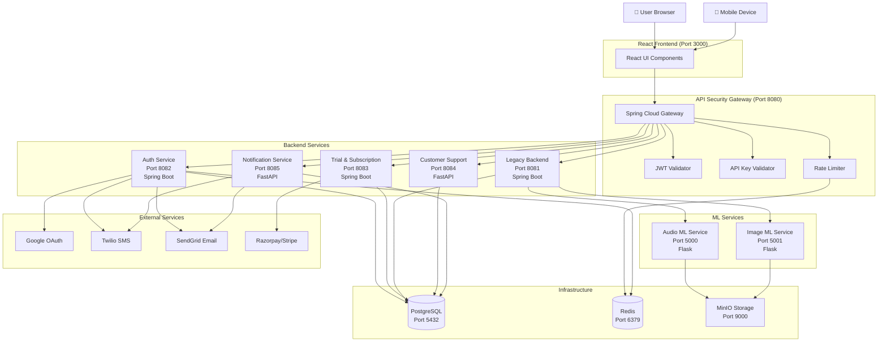
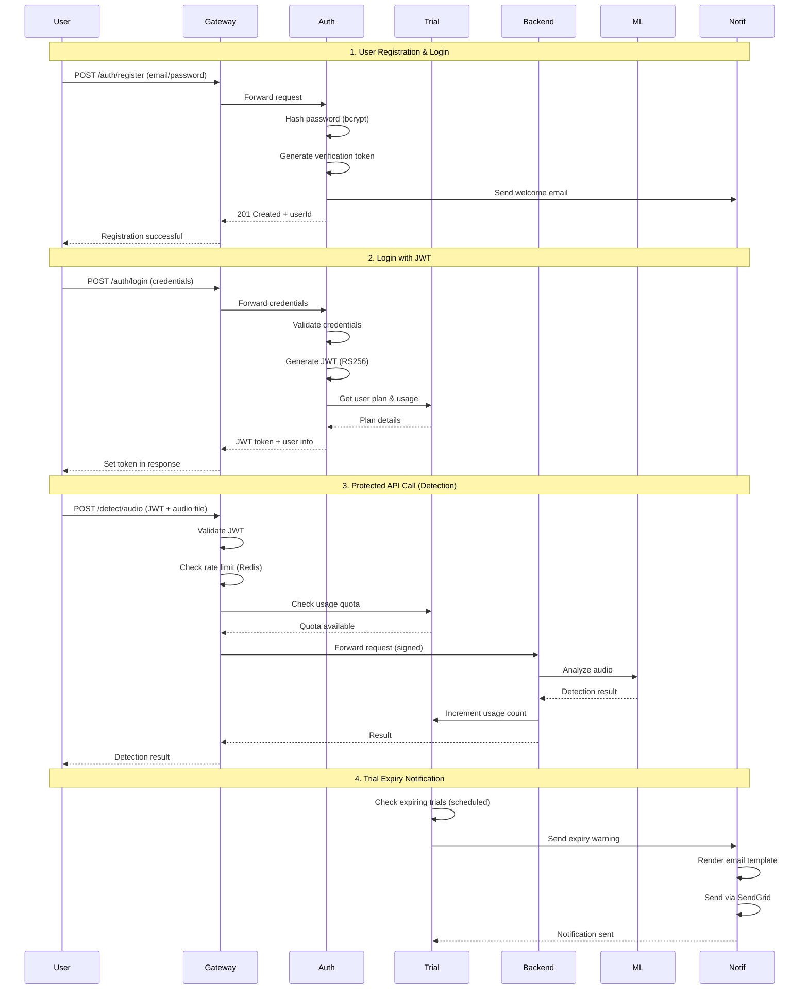
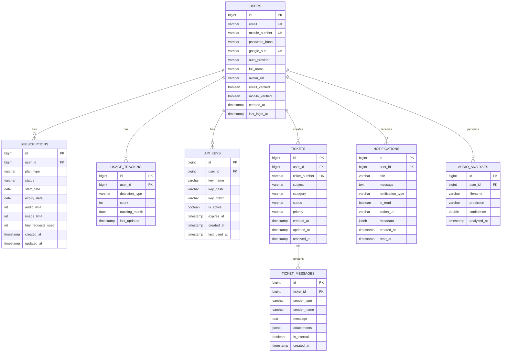

# Design Document: Microservices Architecture Upgrade for MayaBhedak

## Overview

This design transforms the existing monolithic MayaBhedak deepfake detection platform into a microservices architecture with five new services: Auth Service (multi-provider authentication), Free Trial & Subscription Service (usage tracking and billing), API Security Gateway (centralized security), Customer Support Service (ticket system), and Notification Service (email/SMS/in-app alerts). The architecture emphasizes simplicity for local development while maintaining production-ready patterns. All services communicate through well-defined REST APIs, share a common PostgreSQL database, use Redis for caching/rate-limiting, and are orchestrated via Docker Compose for easy local setup.

## Architecture

### System Context Diagram



### Service Communication Flow



## Components and Interfaces

### Component 1: API Security Gateway (Spring Cloud Gateway)


**Purpose**: Single entry point for all API requests, handles authentication, authorization, rate limiting, and request routing

**Port**: 8080

**Interface**:
```java
// Gateway Routes Configuration
interface GatewayRoutes {
  // Auth routes
  POST   /auth/register
  POST   /auth/login
  POST   /auth/login/google
  POST   /auth/login/mobile
  POST   /auth/verify-email
  POST   /auth/forgot-password
  POST   /auth/reset-password
  GET    /auth/me
  
  // Detection routes (protected)
  POST   /detect/audio        // → Legacy Backend → Audio ML
  POST   /detect/image        // → Legacy Backend → Image ML
  GET    /detect/history      // → Legacy Backend
  
  // Trial & Subscription routes (protected)
  GET    /subscription/plan
  GET    /subscription/usage
  POST   /subscription/upgrade
  
  // Support routes (protected)
  POST   /support/tickets
  GET    /support/tickets
  GET    /support/tickets/:id
  POST   /support/tickets/:id/reply
  GET    /support/faq
  
  // Health check
  GET    /health              // Aggregated health from all services
}

// JWT Validation Filter
interface JWTValidator {
  boolean validateToken(String token)
  Claims extractClaims(String token)
  boolean isTokenExpired(String token)
}

// Rate Limiting Filter
interface RateLimiter {
  boolean allowRequest(String userId, String plan)
  int getRemainingRequests(String userId)
  void resetLimit(String userId)
}
```

**Responsibilities**:
- Route requests to appropriate microservices
- Validate JWT tokens (RS256 signature verification)
- Validate API keys for programmatic access
- Enforce rate limits based on user plan (Free: 10/min, Pro: 100/min, Enterprise: 1000/min)
- Add security headers (HSTS, CSP, X-Frame-Options, X-Content-Type-Options)
- Sign requests to ML services using HMAC-SHA256
- Aggregate health status from all services
- Handle CORS for frontend requests
- Log all requests for audit trail

**Configuration**:
```yaml
spring:
  cloud:
    gateway:
      routes:
        - id: auth-service
          uri: http://auth-service:8082
          predicates:
            - Path=/auth/**
          filters:
            - name: RateLimiter
              args:
                redis-rate-limiter.replenishRate: 10
                redis-rate-limiter.burstCapacity: 20
```

---

### Component 2: Auth Service (Spring Boot)


**Purpose**: Manages user authentication via three methods: Email/Password, Mobile OTP, and Google OAuth 2.0

**Port**: 8082

**Interface**:
```java
// REST API Endpoints
interface AuthController {
  // Email/Password Authentication
  UserResponse register(RegisterRequest request)
  LoginResponse login(LoginRequest credentials)
  void verifyEmail(String token)
  void forgotPassword(String email)
  void resetPassword(String token, String newPassword)
  
  // Google OAuth 2.0
  LoginResponse loginWithGoogle(String authorizationCode)
  String getGoogleAuthUrl()
  
  // Mobile OTP Authentication
  OTPResponse sendOTP(String mobileNumber)
  LoginResponse verifyOTP(String mobileNumber, String otp)
  
  // Token Management
  UserResponse getCurrentUser(String jwtToken)
  LoginResponse refreshToken(String refreshToken)
  void logout(String jwtToken)
}

// Data Transfer Objects
class RegisterRequest {
  String email
  String password
  String fullName
  String mobileNumber  // Optional
}

class LoginRequest {
  String email
  String password
}

class LoginResponse {
  String accessToken      // JWT (15 min expiry)
  String refreshToken     // JWT (7 day expiry)
  UserResponse user
  PlanInfo plan
}

class UserResponse {
  Long id
  String email
  String mobileNumber
  String fullName
  String avatarUrl
  String authProvider     // EMAIL, GOOGLE, MOBILE
  boolean emailVerified
  boolean mobileVerified
  LocalDateTime createdAt
  LocalDateTime lastLoginAt
}

class PlanInfo {
  String planType         // FREE_TRIAL, PRO, ENTERPRISE
  int trialRequestsUsed
  int trialRequestsLimit
  LocalDate trialExpiresAt
}

// JWT Token Structure
class JWTPayload {
  Long userId
  String email
  String plan
  String[] roles
  Long iat               // Issued at
  Long exp               // Expiration
}
```

**Responsibilities**:
- User registration with email/password (bcrypt hashing with salt rounds=10)
- Email verification via SendGrid (6-digit code, 15-minute expiry)
- Google OAuth 2.0 integration using spring-boot-starter-oauth2-client
- Mobile OTP via Twilio SMS (6-digit code, 5-minute expiry)
- JWT generation using RS256 algorithm (private key signing)
- Password reset flow with secure tokens
- Session management with Redis for token blacklist
- Refresh token rotation for enhanced security
- User profile updates
- Last login timestamp tracking

**Dependencies**:
- Spring Security
- spring-boot-starter-oauth2-client
- jjwt (JWT library)
- bcrypt for password hashing
- Twilio Java SDK
- SendGrid Java SDK
- PostgreSQL (users table)
- Redis (token blacklist, OTP storage)

---

### Component 3: Free Trial & Subscription Service (Spring Boot)


**Purpose**: Manages user subscriptions, free trial quotas, usage tracking, and upgrade flows

**Port**: 8083

**Interface**:
```java
// REST API Endpoints
interface SubscriptionController {
  // Plan Management
  PlanDetails getCurrentPlan(Long userId)
  UsageStats getUsage(Long userId)
  UpgradeResponse upgradePlan(Long userId, UpgradeRequest request)
  void cancelSubscription(Long userId)
  
  // Trial Management
  TrialStatus getTrialStatus(Long userId)
  void initializeTrialForNewUser(Long userId)
  
  // Usage Tracking (Internal APIs - called by other services)
  boolean checkQuota(Long userId, String detectionType)
  void incrementUsage(Long userId, String detectionType)
  
  // Billing
  List<Invoice> getInvoices(Long userId)
  PaymentIntent createPaymentIntent(Long userId, String planType)
}

// Data Transfer Objects
class PlanDetails {
  String planType         // FREE_TRIAL, PRO, ENTERPRISE
  String status           // ACTIVE, EXPIRED, CANCELLED
  LocalDate startDate
  LocalDate expiryDate
  PlanLimits limits
  PlanFeatures features
}

class PlanLimits {
  int audioDetectionsPerMonth
  int imageDetectionsPerMonth
  int apiCallsPerMinute
  boolean bulkUpload
  boolean apiAccess
  boolean prioritySupport
}

class PlanFeatures {
  // FREE_TRIAL
  static PlanFeatures FREE_TRIAL = {
    audioDetections: 50,
    imageDetections: 50,
    rateLimit: 10,
    duration: 14 days,
    bulkUpload: false,
    apiAccess: false,
    prioritySupport: false
  }
  
  // PRO (₹999/month)
  static PlanFeatures PRO = {
    audioDetections: 1000,
    imageDetections: 1000,
    rateLimit: 100,
    duration: 30 days,
    bulkUpload: true,
    apiAccess: true,
    prioritySupport: false
  }
  
  // ENTERPRISE (custom pricing)
  static PlanFeatures ENTERPRISE = {
    audioDetections: unlimited,
    imageDetections: unlimited,
    rateLimit: 1000,
    duration: custom,
    bulkUpload: true,
    apiAccess: true,
    prioritySupport: true
  }
}

class UsageStats {
  int audioUsedThisMonth
  int imageUsedThisMonth
  int audioRemainingThisMonth
  int imageRemainingThisMonth
  double usagePercentage
  LocalDateTime resetDate
}

class UpgradeRequest {
  String targetPlan       // PRO, ENTERPRISE
  String paymentMethodId
  String billingCycle     // MONTHLY, YEARLY
}

class UpgradeResponse {
  boolean success
  String newPlan
  PaymentStatus paymentStatus
  LocalDate nextBillingDate
}
```

**Responsibilities**:
- Initialize 14-day free trial for new users (50 audio + 50 image detections)
- Track usage per user per month
- Enforce quota limits before allowing detections
- Calculate usage percentage for UI warnings (>80% triggers banner)
- Handle plan upgrades via Razorpay/Stripe
- Schedule trial expiry notifications (3 days before, 1 day before, on expiry)
- Reset monthly usage counters
- Generate invoices and billing history
- Support annual vs monthly billing with discounts
- Handle grace period for payment failures

**Dependencies**:
- PostgreSQL (subscriptions, usage_tracking tables)
- Razorpay/Stripe SDK (payment processing)
- Spring Scheduler (for expiry checks)
- Notification Service (for alerts)

---

### Component 4: Customer Support Service (FastAPI)


**Purpose**: Manages customer support tickets, FAQ system, and support agent communication

**Port**: 8084

**Interface**:
```python
# REST API Endpoints
class SupportAPI:
    # Ticket Management
    @router.post("/tickets")
    async def create_ticket(request: CreateTicketRequest) -> TicketResponse
    
    @router.get("/tickets")
    async def list_tickets(user_id: int, status: Optional[str] = None) -> List[TicketSummary]
    
    @router.get("/tickets/{ticket_id}")
    async def get_ticket_details(ticket_id: int, user_id: int) -> TicketDetails
    
    @router.post("/tickets/{ticket_id}/reply")
    async def add_reply(ticket_id: int, request: ReplyRequest) -> MessageResponse
    
    @router.patch("/tickets/{ticket_id}/close")
    async def close_ticket(ticket_id: int, user_id: int) -> TicketResponse
    
    # FAQ Management
    @router.get("/faq")
    async def get_faq() -> List[FAQItem]
    
    @router.get("/faq/search")
    async def search_faq(query: str) -> List[FAQItem]

# Data Models
class CreateTicketRequest(BaseModel):
    user_id: int
    subject: str              # Max 200 chars
    description: str          # Max 2000 chars
    category: str             # TECHNICAL, BILLING, FEATURE_REQUEST, BUG_REPORT
    priority: Optional[str]   # Auto-assigned if not provided
    attachments: Optional[List[str]]  # File URLs

class TicketResponse(BaseModel):
    ticket_id: int
    ticket_number: str        # Format: TKT-2024-000001
    status: str               # OPEN, IN_PROGRESS, WAITING_USER, RESOLVED, CLOSED
    priority: str             # LOW, MEDIUM, HIGH, URGENT
    created_at: datetime
    updated_at: datetime

class TicketSummary(BaseModel):
    ticket_id: int
    ticket_number: str
    subject: str
    status: str
    priority: str
    created_at: datetime
    last_reply_at: Optional[datetime]
    unread_count: int

class TicketDetails(BaseModel):
    ticket: TicketResponse
    messages: List[MessageResponse]
    user_info: UserInfo

class ReplyRequest(BaseModel):
    user_id: int
    message: str
    is_internal: bool = False  # Internal notes not visible to user
    attachments: Optional[List[str]]

class MessageResponse(BaseModel):
    message_id: int
    ticket_id: int
    sender_type: str          # USER, AGENT, SYSTEM
    sender_name: str
    message: str
    created_at: datetime
    attachments: List[str]

class FAQItem(BaseModel):
    faq_id: int
    category: str
    question: str
    answer: str
    helpful_count: int
    order: int
```

**Responsibilities**:
- Create and manage support tickets with unique ticket numbers
- Auto-assign priority based on keywords (e.g., "urgent", "not working" → HIGH)
- Thread-based conversation view (ticket + all replies)
- Email notifications on ticket creation and replies
- FAQ system with 10 pre-populated common questions
- Search functionality for FAQ
- Track ticket metrics (average response time, resolution time)
- File attachment support (stored in MinIO)
- Internal notes for support agents

**FAQ Content** (Initial 10 Questions):
1. How do I upload audio/image for detection?
2. What file formats are supported?
3. How accurate is the detection?
4. What happens after my free trial expires?
5. How do I upgrade to Pro plan?
6. Can I get a refund?
7. How do I generate an API key?
8. What are the rate limits for each plan?
9. Is my data stored permanently?
10. How do I delete my account?

**Dependencies**:
- PostgreSQL (tickets, ticket_messages, faq tables)
- MinIO (file attachments)
- Notification Service (email alerts)
- FastAPI framework
- SQLAlchemy ORM

---

### Component 5: Notification Service (FastAPI)


**Purpose**: Centralized service for sending email, SMS, and in-app notifications

**Port**: 8085

**Interface**:
```python
# REST API Endpoints
class NotificationAPI:
    # Send Notifications (Internal APIs - called by other services)
    @router.post("/send/email")
    async def send_email(request: EmailRequest) -> NotificationResponse
    
    @router.post("/send/sms")
    async def send_sms(request: SMSRequest) -> NotificationResponse
    
    @router.post("/send/in-app")
    async def create_in_app_notification(request: InAppRequest) -> NotificationResponse
    
    # In-App Notifications (User-facing APIs)
    @router.get("/notifications")
    async def get_notifications(user_id: int, unread_only: bool = False) -> List[InAppNotification]
    
    @router.get("/notifications/unread-count")
    async def get_unread_count(user_id: int) -> UnreadCountResponse
    
    @router.patch("/notifications/{notification_id}/read")
    async def mark_as_read(notification_id: int, user_id: int) -> NotificationResponse
    
    @router.patch("/notifications/read-all")
    async def mark_all_as_read(user_id: int) -> NotificationResponse
    
    # Notification Preferences
    @router.get("/preferences")
    async def get_preferences(user_id: int) -> NotificationPreferences
    
    @router.put("/preferences")
    async def update_preferences(user_id: int, prefs: NotificationPreferences) -> NotificationResponse

# Data Models
class EmailRequest(BaseModel):
    template_name: str        # welcome, otp, trial_expiry, ticket_update, weekly_digest
    recipient_email: str
    recipient_name: str
    subject: str
    template_data: dict       # Dynamic data for template rendering
    priority: str = "NORMAL"  # HIGH, NORMAL, LOW

class SMSRequest(BaseModel):
    recipient_phone: str      # E.164 format: +911234567890
    message: str
    template_name: Optional[str]  # otp, trial_expiry, urgent_alert

class InAppRequest(BaseModel):
    user_id: int
    title: str
    message: str
    notification_type: str    # INFO, WARNING, ERROR, SUCCESS
    action_url: Optional[str]
    metadata: Optional[dict]

class InAppNotification(BaseModel):
    notification_id: int
    user_id: int
    title: str
    message: str
    notification_type: str
    is_read: bool
    action_url: Optional[str]
    created_at: datetime

class NotificationResponse(BaseModel):
    success: bool
    notification_id: Optional[int]
    message: str
    provider_response: Optional[dict]

class UnreadCountResponse(BaseModel):
    unread_count: int

class NotificationPreferences(BaseModel):
    user_id: int
    email_enabled: bool = True
    sms_enabled: bool = True
    in_app_enabled: bool = True
    marketing_emails: bool = False
    digest_frequency: str = "WEEKLY"  # DAILY, WEEKLY, NEVER
```

**Responsibilities**:
- Send emails via SendGrid with HTML templates
- Send SMS via Twilio for OTP and urgent alerts
- Create in-app notifications stored in database
- Real-time notification delivery via Redis pub/sub
- Template management for consistent messaging
- Retry logic for failed deliveries (exponential backoff)
- Track notification delivery status
- User notification preferences management
- Weekly digest emails with usage summary
- Notification history and audit trail

**Email Templates**:
1. **Welcome Email**: Sent after registration
2. **OTP Email**: Email verification code
3. **Trial Expiry Warning**: 3 days before, 1 day before, on expiry
4. **Ticket Update**: New reply on support ticket
5. **Weekly Digest**: Usage summary, tips, feature highlights
6. **Password Reset**: Secure reset link
7. **Plan Upgrade**: Confirmation of subscription change
8. **Payment Failed**: Billing issue alert

**Dependencies**:
- SendGrid Python SDK
- Twilio Python SDK
- PostgreSQL (notifications, notification_preferences tables)
- Redis (pub/sub for real-time notifications)
- Jinja2 (template rendering)
- FastAPI framework

---

## Data Models


### Database Schema Overview



### Table Definitions with Constraints

#### 1. users

```sql
CREATE TABLE users (
    id BIGSERIAL PRIMARY KEY,
    email VARCHAR(255) UNIQUE,
    mobile_number VARCHAR(20) UNIQUE,
    password_hash VARCHAR(255),
    google_sub VARCHAR(255) UNIQUE,
    auth_provider VARCHAR(20) NOT NULL CHECK (auth_provider IN ('EMAIL', 'GOOGLE', 'MOBILE')),
    full_name VARCHAR(255) NOT NULL,
    avatar_url VARCHAR(500),
    email_verified BOOLEAN DEFAULT FALSE,
    mobile_verified BOOLEAN DEFAULT FALSE,
    created_at TIMESTAMP DEFAULT CURRENT_TIMESTAMP,
    last_login_at TIMESTAMP,
    
    CONSTRAINT valid_auth_method CHECK (
        (auth_provider = 'EMAIL' AND email IS NOT NULL AND password_hash IS NOT NULL) OR
        (auth_provider = 'GOOGLE' AND google_sub IS NOT NULL) OR
        (auth_provider = 'MOBILE' AND mobile_number IS NOT NULL)
    )
);

CREATE INDEX idx_users_email ON users(email);
CREATE INDEX idx_users_mobile ON users(mobile_number);
CREATE INDEX idx_users_google_sub ON users(google_sub);
```

**Validation Rules**:
- Email must be valid format (validated by application)
- Mobile number must be E.164 format: +[country code][number]
- Password must be bcrypt hashed (60 characters)
- At least one authentication method must be present
- google_sub is unique identifier from Google OAuth

#### 2. subscriptions

```sql
CREATE TABLE subscriptions (
    id BIGSERIAL PRIMARY KEY,
    user_id BIGINT NOT NULL REFERENCES users(id) ON DELETE CASCADE,
    plan_type VARCHAR(20) NOT NULL CHECK (plan_type IN ('FREE_TRIAL', 'PRO', 'ENTERPRISE')),
    status VARCHAR(20) NOT NULL CHECK (status IN ('ACTIVE', 'EXPIRED', 'CANCELLED', 'PAYMENT_FAILED')),
    start_date DATE NOT NULL,
    expiry_date DATE NOT NULL,
    audio_limit INT NOT NULL,
    image_limit INT NOT NULL,
    trial_requests_used INT DEFAULT 0,
    created_at TIMESTAMP DEFAULT CURRENT_TIMESTAMP,
    updated_at TIMESTAMP DEFAULT CURRENT_TIMESTAMP,
    
    CONSTRAINT valid_limits CHECK (audio_limit >= 0 AND image_limit >= 0),
    CONSTRAINT valid_trial_usage CHECK (trial_requests_used <= (audio_limit + image_limit)),
    CONSTRAINT valid_dates CHECK (expiry_date >= start_date)
);

CREATE INDEX idx_subscriptions_user_id ON subscriptions(user_id);
CREATE INDEX idx_subscriptions_expiry ON subscriptions(expiry_date) WHERE status = 'ACTIVE';
```

**Validation Rules**:
- Only one active subscription per user
- Free trial: 50 audio + 50 image, 14 days
- Pro: 1000 audio + 1000 image, 30 days
- Enterprise: custom limits
- Expiry date must be after start date

#### 3. usage_tracking


```sql
CREATE TABLE usage_tracking (
    id BIGSERIAL PRIMARY KEY,
    user_id BIGINT NOT NULL REFERENCES users(id) ON DELETE CASCADE,
    detection_type VARCHAR(20) NOT NULL CHECK (detection_type IN ('AUDIO', 'IMAGE')),
    count INT NOT NULL DEFAULT 0,
    tracking_month DATE NOT NULL,  -- First day of month: 2024-01-01
    last_updated TIMESTAMP DEFAULT CURRENT_TIMESTAMP,
    
    UNIQUE(user_id, detection_type, tracking_month),
    CONSTRAINT valid_count CHECK (count >= 0)
);

CREATE INDEX idx_usage_user_month ON usage_tracking(user_id, tracking_month);
```

**Validation Rules**:
- One row per user per detection type per month
- Count incremented atomically on each detection
- Reset automatically on first day of new month
- Used to enforce quota limits

#### 4. api_keys

```sql
CREATE TABLE api_keys (
    id BIGSERIAL PRIMARY KEY,
    user_id BIGINT NOT NULL REFERENCES users(id) ON DELETE CASCADE,
    key_name VARCHAR(100) NOT NULL,
    key_hash VARCHAR(64) NOT NULL,  -- SHA-256 hash
    key_prefix VARCHAR(10) NOT NULL,  -- First 8 chars for display: mb_live_abc12345
    is_active BOOLEAN DEFAULT TRUE,
    expires_at TIMESTAMP,
    created_at TIMESTAMP DEFAULT CURRENT_TIMESTAMP,
    last_used_at TIMESTAMP,
    
    UNIQUE(key_hash)
);

CREATE INDEX idx_api_keys_user_id ON api_keys(user_id);
CREATE INDEX idx_api_keys_prefix ON api_keys(key_prefix);
CREATE INDEX idx_api_keys_hash ON api_keys(key_hash) WHERE is_active = TRUE;
```

**Validation Rules**:
- API key format: `mb_live_[32-char-random]` or `mb_test_[32-char-random]`
- Stored as SHA-256 hash (64 hex chars)
- Prefix shown in UI for identification: `mb_live_abc1...`
- Keys can be rotated with grace period (old key valid for 24 hours)
- Pro plan: max 5 keys, Enterprise: unlimited

#### 5. tickets

```sql
CREATE TABLE tickets (
    id BIGSERIAL PRIMARY KEY,
    user_id BIGINT NOT NULL REFERENCES users(id) ON DELETE CASCADE,
    ticket_number VARCHAR(20) UNIQUE NOT NULL,  -- Format: TKT-2024-000001
    subject VARCHAR(200) NOT NULL,
    category VARCHAR(30) NOT NULL CHECK (category IN ('TECHNICAL', 'BILLING', 'FEATURE_REQUEST', 'BUG_REPORT', 'OTHER')),
    status VARCHAR(20) NOT NULL CHECK (status IN ('OPEN', 'IN_PROGRESS', 'WAITING_USER', 'RESOLVED', 'CLOSED')),
    priority VARCHAR(10) NOT NULL CHECK (priority IN ('LOW', 'MEDIUM', 'HIGH', 'URGENT')),
    created_at TIMESTAMP DEFAULT CURRENT_TIMESTAMP,
    updated_at TIMESTAMP DEFAULT CURRENT_TIMESTAMP,
    resolved_at TIMESTAMP,
    
    CONSTRAINT valid_resolution CHECK (
        (status IN ('RESOLVED', 'CLOSED') AND resolved_at IS NOT NULL) OR
        (status NOT IN ('RESOLVED', 'CLOSED') AND resolved_at IS NULL)
    )
);

CREATE INDEX idx_tickets_user_id ON tickets(user_id);
CREATE INDEX idx_tickets_status ON tickets(status);
CREATE INDEX idx_tickets_created_at ON tickets(created_at DESC);
```

**Validation Rules**:
- Ticket number auto-generated sequentially
- Subject max 200 characters
- Status transitions: OPEN → IN_PROGRESS → WAITING_USER → RESOLVED → CLOSED
- Priority auto-assigned based on keywords in subject/description
- resolved_at set when status changes to RESOLVED or CLOSED

#### 6. ticket_messages

```sql
CREATE TABLE ticket_messages (
    id BIGSERIAL PRIMARY KEY,
    ticket_id BIGINT NOT NULL REFERENCES tickets(id) ON DELETE CASCADE,
    sender_type VARCHAR(10) NOT NULL CHECK (sender_type IN ('USER', 'AGENT', 'SYSTEM')),
    sender_name VARCHAR(255) NOT NULL,
    message TEXT NOT NULL,
    attachments JSONB DEFAULT '[]',  -- Array of file URLs
    is_internal BOOLEAN DEFAULT FALSE,  -- Internal notes not visible to user
    created_at TIMESTAMP DEFAULT CURRENT_TIMESTAMP
);

CREATE INDEX idx_ticket_messages_ticket_id ON ticket_messages(ticket_id, created_at);
```

**Validation Rules**:
- Message cannot be empty
- Attachments stored as JSON array: `["https://minio.../file1.pdf", "https://minio.../file2.png"]`
- Internal messages only visible to support agents
- System messages auto-generated for status changes

#### 7. notifications

```sql
CREATE TABLE notifications (
    id BIGSERIAL PRIMARY KEY,
    user_id BIGINT NOT NULL REFERENCES users(id) ON DELETE CASCADE,
    title VARCHAR(200) NOT NULL,
    message TEXT NOT NULL,
    notification_type VARCHAR(20) NOT NULL CHECK (notification_type IN ('INFO', 'WARNING', 'ERROR', 'SUCCESS')),
    is_read BOOLEAN DEFAULT FALSE,
    action_url VARCHAR(500),
    metadata JSONB,  -- Additional context
    created_at TIMESTAMP DEFAULT CURRENT_TIMESTAMP,
    read_at TIMESTAMP
);

CREATE INDEX idx_notifications_user_id ON notifications(user_id, created_at DESC);
CREATE INDEX idx_notifications_unread ON notifications(user_id, is_read) WHERE is_read = FALSE;
```

**Validation Rules**:
- Title max 200 characters
- action_url is optional deep link within app
- metadata stores additional context as JSON
- read_at timestamp set when user marks as read
- Old notifications auto-deleted after 90 days

---

## Correctness Properties

### 1. Authentication & Authorization
- ∀ request ∈ ProtectedEndpoints: ValidJWT(request.token) ∨ ValidAPIKey(request.apiKey)
- ∀ user ∈ Users: ∃! authMethod ∈ {Email, Google, Mobile} such that user.authProvider = authMethod
- ∀ password ∈ Passwords: bcrypt.verify(password, stored_hash) ⟹ length(password) ≥ 8 ∧ hasUpperCase(password) ∧ hasLowerCase(password) ∧ hasDigit(password)
- ∀ jwt ∈ JWTokens: isExpired(jwt) ⟹ rejectRequest(jwt)
- ∀ otp ∈ OTPCodes: isValid(otp) ⟺ (now() - otp.createdAt) < 5 minutes ∧ otp.attemptCount < 3

### 2. Trial & Subscription Management

- ∀ user ∈ NewUsers: initializeTrial(user) ⟹ (user.audioLimit = 50 ∧ user.imageLimit = 50 ∧ user.trialDuration = 14 days)
- ∀ detection ∈ DetectionRequests: allowDetection(detection) ⟺ (user.usageCount < user.limit) ∧ (user.subscription.status = ACTIVE)
- ∀ subscription ∈ Subscriptions: now() > subscription.expiryDate ⟹ subscription.status = EXPIRED
- ∀ user ∈ Users: usagePercentage(user) > 80% ⟹ showWarningBanner(user)
- ∀ upgrade ∈ UpgradeRequests: processUpgrade(upgrade) ⟹ previousSubscription.status = CANCELLED ∧ newSubscription.status = ACTIVE

### 3. Rate Limiting
- ∀ user ∈ FreeTierUsers: requestCount(user, 1 minute) ≤ 10
- ∀ user ∈ ProUsers: requestCount(user, 1 minute) ≤ 100
- ∀ user ∈ EnterpriseUsers: requestCount(user, 1 minute) ≤ 1000
- ∀ request ∈ Requests: exceedsRateLimit(request) ⟹ returnHTTP(429, "Rate limit exceeded")
- ∀ user ∈ Users: rateLimitWindow(user) resets every 60 seconds

### 4. API Key Security
- ∀ apiKey ∈ APIKeys: stored(apiKey) = SHA256(apiKey.plaintext)
- ∀ apiKey ∈ APIKeys: display(apiKey) = apiKey.prefix + "..." (only first 8 chars visible)
- ∀ rotation ∈ KeyRotations: oldKey.expiresAt = now() + 24 hours (grace period)
- ∀ apiKey ∈ APIKeys: isExpired(apiKey) ⟹ rejectRequest(apiKey)
- ∀ user ∈ ProUsers: count(user.apiKeys) ≤ 5

### 5. Support Tickets
- ∀ ticket ∈ Tickets: ticket.ticketNumber is unique ∧ follows format "TKT-YYYY-NNNNNN"
- ∀ ticket ∈ Tickets: (ticket.status = RESOLVED ∨ ticket.status = CLOSED) ⟹ ticket.resolvedAt ≠ null
- ∀ reply ∈ TicketReplies: sendNotification(ticket.user, "New reply on ticket " + ticket.ticketNumber)
- ∀ ticket ∈ Tickets: containsKeyword(ticket.subject, urgentKeywords) ⟹ ticket.priority = HIGH
- ∀ message ∈ TicketMessages: message.isInternal = true ⟹ visibleTo(message) = {AGENTS}

### 6. Notifications
- ∀ notification ∈ Notifications: deliveryFailed(notification) ⟹ retry(notification, exponentialBackoff)
- ∀ user ∈ Users: unreadCount(user) = count(notifications WHERE user_id = user.id AND is_read = FALSE)
- ∀ email ∈ Emails: renderTemplate(email.template, email.data) before sending
- ∀ notification ∈ Notifications: age(notification) > 90 days ⟹ autoDelete(notification)
- ∀ sms ∈ SMSMessages: formatPhoneNumber(sms.recipient) matches E.164 format

### 7. Data Integrity
- ∀ user ∈ Users: deleteUser(user) ⟹ cascade delete (subscriptions, tickets, notifications, api_keys)
- ∀ subscription ∈ Subscriptions: subscription.expiryDate ≥ subscription.startDate
- ∀ usage ∈ UsageTracking: usage.count ≥ 0 ∧ usage.count is atomically incremented
- ∀ transaction ∈ DatabaseTransactions: ACID properties maintained
- ∀ password ∈ Passwords: never logged or transmitted in plain text

---

## Error Handling

### Error Scenario 1: JWT Token Expired

**Condition**: User's access token expires (15 minutes after issuance)

**Response**: 
- API Gateway returns HTTP 401 Unauthorized with error code: `TOKEN_EXPIRED`
- Frontend automatically attempts token refresh using refresh token
- If refresh successful: retry original request with new token
- If refresh failed: redirect to login page

**Recovery**: User can login again or use "Remember Me" feature for automatic refresh

### Error Scenario 2: Rate Limit Exceeded

**Condition**: User exceeds plan's rate limit (Free: 10/min, Pro: 100/min, Enterprise: 1000/min)

**Response**:
- API Gateway returns HTTP 429 Too Many Requests
- Response headers include: `X-RateLimit-Limit`, `X-RateLimit-Remaining`, `X-RateLimit-Reset`
- Error message: "Rate limit exceeded. Upgrade to Pro for higher limits."

**Recovery**: 
- User waits until rate limit window resets (60 seconds)
- User upgrades to higher plan for increased limits
- Enterprise users contact support for custom limits

### Error Scenario 3: Trial Quota Exhausted

**Condition**: User reaches 50 audio + 50 image detection limit during free trial

**Response**:
- Detection request returns HTTP 403 Forbidden with error code: `QUOTA_EXCEEDED`
- UI shows upgrade modal with Pro plan benefits
- Email notification sent with upgrade link

**Recovery**:
- User upgrades to Pro plan (₹999/month) for 1000 detections
- User waits for next month if on paid plan (monthly quota resets)

### Error Scenario 4: Google OAuth Failure

**Condition**: Google OAuth authorization fails or user denies permissions

**Response**:
- Auth Service logs error details
- Returns HTTP 400 Bad Request with error: `OAUTH_FAILED`
- User-friendly message: "Google login failed. Please try again or use email login."

**Recovery**:
- User retries Google login
- User switches to email/password or mobile OTP authentication
- Admin reviews logs if issue persists

### Error Scenario 5: Payment Processing Failure

**Condition**: Razorpay/Stripe payment fails during plan upgrade

**Response**:
- Subscription Service rolls back transaction
- Returns HTTP 402 Payment Required with error code: `PAYMENT_FAILED`
- User's plan remains unchanged
- Email notification sent with retry instructions

**Recovery**:
- User retries payment with same or different payment method
- User contacts support for payment issues
- Grace period of 3 days before downgrading plan

### Error Scenario 6: Twilio SMS Delivery Failure

**Condition**: Twilio fails to deliver OTP SMS (invalid number, network issue, etc.)

**Response**:
- Notification Service logs delivery failure with Twilio error code
- Returns HTTP 503 Service Unavailable
- Suggests alternative: "SMS delivery failed. Try email verification instead."

**Recovery**:
- User requests new OTP (max 3 attempts per 5 minutes)
- User switches to email verification
- Admin reviews Twilio logs for systematic issues

### Error Scenario 7: Database Connection Lost

**Condition**: PostgreSQL connection pool exhausted or database unreachable

**Response**:
- All affected services return HTTP 503 Service Unavailable
- Circuit breaker pattern activates to prevent cascading failures
- Health check endpoint reports degraded status

**Recovery**:
- Connection pool auto-recovers with retry logic
- Database replica promoted if primary fails (production setup)
- Admin receives alert for manual intervention if needed

### Error Scenario 8: Support Ticket Attachment Upload Fails

**Condition**: MinIO storage unavailable or file size exceeds limit (10MB)

**Response**:
- Support Service returns HTTP 413 Payload Too Large or HTTP 503 Service Unavailable
- Ticket is created without attachment
- User notified: "Attachment upload failed. Ticket created successfully."

**Recovery**:
- User replies to ticket with attachment after service recovery
- User compresses file to reduce size
- User provides alternative file sharing link (Google Drive, etc.)

---

## Testing Strategy

### Unit Testing Approach

Each microservice includes comprehensive unit tests with >80% code coverage:

**Auth Service**:
- Password hashing and verification (bcrypt)
- JWT generation and validation (RS256)
- Google OAuth token exchange
- OTP generation and validation
- Email/mobile format validation

**Trial & Subscription Service**:
- Trial initialization logic
- Usage quota enforcement
- Plan upgrade calculations
- Billing cycle management
- Expiry date calculations

**API Gateway**:
- JWT validation filter
- Rate limiting algorithm (token bucket)
- Request routing logic
- HMAC signature generation
- Security header injection

**Support Service**:
- Ticket number generation
- Priority assignment algorithm
- FAQ search functionality
- Attachment handling

**Notification Service**:
- Email template rendering
- SMS formatting (E.164)
- Retry logic with exponential backoff
- Notification preference filtering

**Testing Tools**:
- JUnit 5 + Mockito (Java services)
- pytest + pytest-mock (Python services)
- H2 in-memory database for repository tests
- Testcontainers for integration tests

### Property-Based Testing Approach


**Property Test Library**: fast-check (JavaScript/TypeScript for API Gateway), Hypothesis (Python for FastAPI services), junit-quickcheck (Java for Spring Boot services)

**Properties to Test**:

1. **JWT Token Properties**:
   - ∀ token: decode(encode(payload)) = payload
   - ∀ token: isExpired(token) ⟺ (now() > token.exp)
   - ∀ token: validSignature(token) ⟹ signedBy(privateKey) ∧ verifiedBy(publicKey)

2. **Rate Limiting Properties**:
   - ∀ user, plan: requests within window ≤ plan.rateLimit
   - ∀ user: after window reset, remainingRequests = plan.rateLimit
   - ∀ burst: consecutive requests up to burstCapacity allowed

3. **Usage Tracking Properties**:
   - ∀ user: usageCount is monotonically increasing within a month
   - ∀ user: usageCount ≤ subscription.limit ∨ detectionRejected
   - ∀ month transition: usageCount resets to 0

4. **API Key Properties**:
   - ∀ key: SHA256(plaintext) = stored_hash
   - ∀ key: display format = prefix + "..." (8 chars visible)
   - ∀ rotation: oldKey valid for gracePeriod, newKey valid immediately

5. **Email Template Properties**:
   - ∀ template, data: rendered output contains all required variables
   - ∀ email: valid email format (RFC 5322)
   - ∀ sms: phone number matches E.164 format

**Example Property Test** (Auth Service - JWT):
```java
@Property
void jwtEncodingAndDecodingAreInverse(
    @ForAll @LongRange(min = 1000, max = 999999) Long userId,
    @ForAll @StringLength(min = 5, max = 50) String email,
    @ForAll("validPlans") String plan
) {
    JWTPayload original = new JWTPayload(userId, email, plan);
    String token = jwtService.generateToken(original);
    JWTPayload decoded = jwtService.decodeToken(token);
    
    assertEquals(original.getUserId(), decoded.getUserId());
    assertEquals(original.getEmail(), decoded.getEmail());
    assertEquals(original.getPlan(), decoded.getPlan());
}

@Provide
Arbitrary<String> validPlans() {
    return Arbitraries.of("FREE_TRIAL", "PRO", "ENTERPRISE");
}
```

### Integration Testing Approach

**Test Scenarios**:

1. **End-to-End User Registration Flow**:
   - User registers with email/password
   - Verification email sent via Notification Service
   - User clicks verification link
   - Trial subscription auto-initialized
   - User logs in and receives JWT
   - JWT used to access protected endpoints

2. **Detection with Quota Enforcement**:
   - User uploads audio file
   - Gateway validates JWT
   - Trial Service checks quota (49/50 used)
   - Detection processed by ML service
   - Usage incremented to 50/50
   - Next detection rejected with QUOTA_EXCEEDED
   - Upgrade modal shown in UI

3. **Support Ticket Creation and Notification**:
   - User creates ticket with attachment
   - Ticket stored in database with unique number
   - Attachment uploaded to MinIO
   - Notification Service sends email to user
   - Support agent replies
   - User receives email notification
   - User marks ticket as resolved

4. **Rate Limiting Across Services**:
   - User makes 10 requests in 60 seconds (Free plan limit)
   - 11th request returns HTTP 429
   - Wait 60 seconds for window reset
   - User successfully makes new request
   - Upgrade to Pro plan
   - Rate limit increases to 100/min

5. **OAuth Login with Plan Retrieval**:
   - User clicks "Login with Google"
   - Redirected to Google OAuth consent screen
   - User approves permissions
   - Auth Service exchanges authorization code for tokens
   - User profile fetched from Google API
   - JWT generated with user data
   - Trial Service returns current plan info
   - User redirected to dashboard

**Integration Test Tools**:
- Testcontainers (Docker containers for PostgreSQL, Redis, MinIO)
- WireMock (mock external APIs: Google, Twilio, SendGrid)
- REST Assured (API testing for Java services)
- pytest + httpx (API testing for Python services)
- Docker Compose (spin up all services for E2E tests)

---

## Performance Considerations

### Latency Requirements

| Operation | Target Latency | Rationale |
|-----------|---------------|-----------|
| JWT Validation | < 5ms | Gateway validates every request |
| Rate Limit Check | < 2ms | Redis lookup must be fast |
| User Login | < 300ms | Includes bcrypt verification (slow by design) |
| Google OAuth | < 1s | Depends on Google API response time |
| Send OTP SMS | < 2s | Twilio API call |
| Detection Request | < 5s | Includes ML inference (dominant factor) |
| Create Support Ticket | < 200ms | Database insert + notification trigger |
| Fetch Notification List | < 100ms | Simple database query with index |

### Caching Strategy

**Redis Cache Usage**:

1. **JWT Blacklist**: 
   - Key: `jwt:blacklist:{tokenId}`
   - TTL: token expiry time
   - Purpose: Invalidate tokens on logout

2. **Rate Limiting**:
   - Key: `ratelimit:{userId}:{window}`
   - Value: request count
   - TTL: 60 seconds
   - Algorithm: Token bucket with Redis INCR

3. **OTP Storage**:
   - Key: `otp:email:{email}` or `otp:mobile:{phone}`
   - Value: `{code: "123456", attempts: 0}`
   - TTL: 5 minutes

4. **User Session**:
   - Key: `session:{userId}`
   - Value: JSON with plan info, usage stats
   - TTL: 15 minutes
   - Purpose: Avoid database lookups on every request

5. **API Key Cache**:
   - Key: `apikey:{keyHash}`
   - Value: `{userId, plan, isActive}`
   - TTL: 10 minutes
   - Purpose: Reduce database load for API key validation

### Database Optimization

**Indexes**:
- `users(email)`, `users(mobile_number)`, `users(google_sub)` - Fast authentication lookups
- `subscriptions(user_id)`, `subscriptions(expiry_date)` - Plan queries and expiry checks
- `usage_tracking(user_id, tracking_month)` - Quota enforcement
- `api_keys(key_hash)` - API key validation
- `tickets(user_id, created_at DESC)` - User's ticket history
- `notifications(user_id, is_read)` - Unread notification count

**Connection Pooling**:
- HikariCP for Java services (default with Spring Boot)
- SQLAlchemy pool for Python services
- Pool size: 10-20 connections per service
- Connection timeout: 30 seconds
- Idle timeout: 10 minutes

**Query Optimization**:
- Avoid N+1 queries (use JOIN or batch fetching)
- Paginate large result sets (tickets, notifications, history)
- Use `SELECT` with specific columns instead of `SELECT *`
- Denormalize usage stats for faster quota checks

### Scalability Considerations

**Horizontal Scaling**:
- All services are stateless (session in Redis, not in-memory)
- Can run multiple instances behind load balancer
- Gateway can scale independently for high traffic
- ML services can scale based on inference workload

**Load Balancing**:
- NGINX or Traefik for Docker Compose
- AWS ALB or GCP Load Balancer for cloud deployment
- Round-robin algorithm with health checks

**Database Scaling**:
- PostgreSQL read replicas for query-heavy services
- Connection pooling to limit concurrent connections
- Partitioning for large tables (usage_tracking by month)
- Archive old data (notifications > 90 days, tickets > 1 year)

**Async Processing**:
- Notification sending via Redis pub/sub (non-blocking)
- Trial expiry checks via scheduled jobs (Spring @Scheduled or Celery)
- Email digests via batch processing (weekly)
- Avoid blocking main request thread for I/O operations

---

## Security Considerations

### Authentication Security

**Password Security**:
- bcrypt with 10 salt rounds (configurable)
- Minimum 8 characters, must contain uppercase, lowercase, digit
- Password complexity enforced on frontend and backend
- Hashed passwords never logged or transmitted
- Rate limiting on login attempts (5 attempts per 15 minutes)

**JWT Security**:
- RS256 algorithm (asymmetric signing)
- Private key for signing (Auth Service only)
- Public key for verification (Gateway and other services)
- Short-lived access tokens (15 minutes)
- Refresh tokens with rotation (7 days, single use)
- Token blacklist in Redis for logout

**OAuth Security**:
- PKCE (Proof Key for Code Exchange) for Google OAuth
- State parameter to prevent CSRF
- Authorization code exchange (not implicit flow)
- Validate Google token signature before trusting claims
- Store only google_sub (not access tokens)

**OTP Security**:
- 6-digit random code (100,000 - 999,999)
- 5-minute expiry
- Max 3 attempts before requiring new OTP
- Rate limiting on OTP requests (3 per 5 minutes per phone/email)
- OTP never logged in plain text

### API Security

**API Key Security**:
- Cryptographically random keys (32 bytes = 256 bits)
- SHA-256 hashing before storage
- Prefix for identification: `mb_live_` or `mb_test_`
- Masked display in UI: `mb_live_abc12345...`
- Rotation with 24-hour grace period
- Key expiry dates (optional)
- Revocation API for compromised keys

**Request Signing**:
- HMAC-SHA256 signature for requests to ML services
- Signature includes: timestamp, request body, endpoint
- Prevents replay attacks (timestamp check within 5 minutes)
- Shared secret between Gateway and ML services

**Rate Limiting**:
- Prevents brute force attacks
- Prevents DDoS attacks
- Per-user limits based on plan
- IP-based limits for unauthenticated endpoints
- Exponential backoff for repeated violations

### Data Security

**Data at Rest**:
- PostgreSQL encryption (TDE - Transparent Data Encryption)
- MinIO encryption for uploaded files
- Encrypted backups
- Secrets in environment variables (not in code)

**Data in Transit**:
- HTTPS/TLS 1.3 for all external communication
- Internal service communication over Docker network (encrypted in production)
- Certificate pinning for mobile apps

**Sensitive Data**:
- PII (email, mobile) encrypted or hashed where possible
- Credit card data never stored (Razorpay/Stripe handles it)
- Audit logs for access to sensitive data
- GDPR compliance: user data export and deletion

### Network Security

**Security Headers**:
```
Strict-Transport-Security: max-age=31536000; includeSubDomains
Content-Security-Policy: default-src 'self'
X-Frame-Options: DENY
X-Content-Type-Options: nosniff
X-XSS-Protection: 1; mode=block
Referrer-Policy: strict-origin-when-cross-origin
```

**CORS Configuration**:
- Whitelist specific origins (frontend domain)
- Restrict methods (GET, POST, PUT, DELETE)
- Credentials allowed only for trusted origins
- Preflight cache: 1 hour

**Input Validation**:
- Validate all inputs on backend (never trust frontend)
- Sanitize inputs to prevent SQL injection (use parameterized queries)
- Sanitize inputs to prevent XSS (escape HTML)
- File upload validation (type, size, content)
- Rate limiting on expensive operations

---

## Dependencies

### External Services

1. **Google OAuth 2.0**
   - Purpose: Gmail login
   - Credentials: Client ID + Client Secret
   - Scopes: `email`, `profile`
   - Setup: https://console.cloud.google.com/

2. **Twilio SMS**
   - Purpose: Send OTP for mobile authentication
   - Credentials: Account SID + Auth Token
   - Cost: ~$0.0075 per SMS (India)
   - Setup: https://www.twilio.com/console

3. **SendGrid Email**
   - Purpose: Transactional emails (verification, notifications)
   - Credentials: API Key
   - Free tier: 100 emails/day
   - Setup: https://app.sendgrid.com/

4. **Razorpay / Stripe**
   - Purpose: Payment processing for subscriptions
   - Credentials: API Key + Secret
   - Razorpay: India-focused (₹ support)
   - Stripe: Global ($ support)
   - Setup: https://dashboard.razorpay.com/ or https://dashboard.stripe.com/

### Infrastructure Dependencies

1. **PostgreSQL 15+**
   - Purpose: Primary database
   - Storage: User data, subscriptions, tickets, notifications
   - Container: `postgres:15-alpine`

2. **Redis 7+**
   - Purpose: Caching, rate limiting, session storage
   - Data structures: String (JWT blacklist), Hash (sessions), Sorted Set (rate limit)
   - Container: `redis:7-alpine`

3. **MinIO**
   - Purpose: S3-compatible object storage
   - Storage: Support ticket attachments, user avatars, analysis files
   - Container: `minio/minio:latest`

4. **Docker & Docker Compose**
   - Purpose: Local development environment
   - Version: Docker 20+, Compose V2
   - Orchestration: All services in single compose file

### Library Dependencies

**Java Services (Auth, Trial, Gateway)**:
- Spring Boot 3.1+
- Spring Security 6+
- spring-boot-starter-oauth2-client
- spring-cloud-starter-gateway
- jjwt (JWT library)
- HikariCP (connection pooling)
- Lombok (boilerplate reduction)
- Flyway (database migrations)

**Python Services (Support, Notification)**:
- FastAPI 0.104+
- SQLAlchemy 2.0+ (ORM)
- alembic (database migrations)
- redis-py (Redis client)
- twilio (SMS)
- sendgrid (email)
- jinja2 (template rendering)
- pydantic (data validation)

**Frontend**:
- React 18+
- React Router 6+
- Axios (HTTP client)
- TailwindCSS (styling)
- Framer Motion (animations)
- React Hook Form (form validation)
- Zustand or Redux (state management)

---

## Local Development Setup

### Prerequisites

```bash
# Required software
- Docker Desktop 4.20+
- Docker Compose V2
- Git
- Node.js 18+ (for frontend)
- Java 17+ (for Spring Boot services)
- Python 3.11+ (for FastAPI services)

# Optional (for development without Docker)
- PostgreSQL 15
- Redis 7
- Maven 3.8+
- npm/yarn
```

### Environment Variables

Create `.env` file in project root:

```env
# PostgreSQL
POSTGRES_HOST=postgres
POSTGRES_PORT=5432
POSTGRES_DB=mayabhedak
POSTGRES_USER=admin
POSTGRES_PASSWORD=secure_password_here

# Redis
REDIS_HOST=redis
REDIS_PORT=6379
REDIS_PASSWORD=

# MinIO
MINIO_ENDPOINT=http://minio:9000
MINIO_ACCESS_KEY=minioadmin
MINIO_SECRET_KEY=minioadmin

# Auth Service (Port 8082)
JWT_PRIVATE_KEY=path/to/private_key.pem
JWT_PUBLIC_KEY=path/to/public_key.pem
JWT_EXPIRATION_MINUTES=15
REFRESH_TOKEN_EXPIRATION_DAYS=7

# Google OAuth
GOOGLE_CLIENT_ID=your_client_id.apps.googleusercontent.com
GOOGLE_CLIENT_SECRET=your_client_secret
GOOGLE_REDIRECT_URI=http://localhost:8082/auth/google/callback

# Twilio SMS
TWILIO_ACCOUNT_SID=your_account_sid
TWILIO_AUTH_TOKEN=your_auth_token
TWILIO_PHONE_NUMBER=+1234567890

# SendGrid Email
SENDGRID_API_KEY=your_sendgrid_api_key
SENDGRID_FROM_EMAIL=noreply@mayabhedak.com
SENDGRID_FROM_NAME=MayaBhedak

# Razorpay (or Stripe)
RAZORPAY_KEY_ID=your_key_id
RAZORPAY_KEY_SECRET=your_key_secret

# Service Ports
GATEWAY_PORT=8080
AUTH_SERVICE_PORT=8082
TRIAL_SERVICE_PORT=8083
BACKEND_SERVICE_PORT=8081
SUPPORT_SERVICE_PORT=8084
NOTIFICATION_SERVICE_PORT=8085
AUDIO_ML_PORT=5000
IMAGE_ML_PORT=5001

# Frontend
VITE_API_URL=http://localhost:8080
```

### Docker Compose File Structure

```yaml
version: '3.8'

services:
  postgres:
    image: postgres:15-alpine
    ports:
      - "5432:5432"
    environment:
      POSTGRES_DB: ${POSTGRES_DB}
      POSTGRES_USER: ${POSTGRES_USER}
      POSTGRES_PASSWORD: ${POSTGRES_PASSWORD}
    volumes:
      - postgres_data:/var/lib/postgresql/data
  
  redis:
    image: redis:7-alpine
    ports:
      - "6379:6379"
    volumes:
      - redis_data:/data
  
  minio:
    image: minio/minio:latest
    ports:
      - "9000:9000"
      - "9001:9001"
    environment:
      MINIO_ROOT_USER: ${MINIO_ACCESS_KEY}
      MINIO_ROOT_PASSWORD: ${MINIO_SECRET_KEY}
    command: server /data --console-address ":9001"
    volumes:
      - minio_data:/data
  
  gateway:
    build: ./gateway
    ports:
      - "8080:8080"
    depends_on:
      - redis
      - auth-service
      - trial-service
    environment:
      REDIS_HOST: ${REDIS_HOST}
  
  auth-service:
    build: ./auth-service
    ports:
      - "8082:8082"
    depends_on:
      - postgres
      - redis
    environment:
      POSTGRES_HOST: ${POSTGRES_HOST}
      REDIS_HOST: ${REDIS_HOST}
      GOOGLE_CLIENT_ID: ${GOOGLE_CLIENT_ID}
  
  trial-service:
    build: ./trial-service
    ports:
      - "8083:8083"
    depends_on:
      - postgres
    environment:
      POSTGRES_HOST: ${POSTGRES_HOST}
  
  support-service:
    build: ./support-service
    ports:
      - "8084:8084"
    depends_on:
      - postgres
      - minio
    environment:
      POSTGRES_HOST: ${POSTGRES_HOST}
      MINIO_ENDPOINT: ${MINIO_ENDPOINT}
  
  notification-service:
    build: ./notification-service
    ports:
      - "8085:8085"
    depends_on:
      - postgres
      - redis
    environment:
      POSTGRES_HOST: ${POSTGRES_HOST}
      REDIS_HOST: ${REDIS_HOST}
      SENDGRID_API_KEY: ${SENDGRID_API_KEY}
      TWILIO_ACCOUNT_SID: ${TWILIO_ACCOUNT_SID}
  
  backend:
    build: ./backend
    ports:
      - "8081:8081"
    depends_on:
      - postgres
    environment:
      POSTGRES_HOST: ${POSTGRES_HOST}
  
  audio-ml:
    build: ./AI-Generated-Image-Detector
    ports:
      - "5000:5000"
    environment:
      MODEL_PATH: /app/outputs/checkpoints/ckpt_best.pth
  
  image-ml:
    build: ./cnnbilstem
    ports:
      - "5001:5001"
    environment:
      MODEL_PATH: /app/best_model.pth
  
  frontend:
    build: ./frontend
    ports:
      - "3000:3000"
    environment:
      VITE_API_URL: http://localhost:8080

volumes:
  postgres_data:
  redis_data:
  minio_data:
```

### Quick Start Commands

```bash
# 1. Clone repository
git clone https://github.com/your-repo/mayabhedak.git
cd mayabhedak

# 2. Copy environment template
cp .env.example .env
# Edit .env with your credentials

# 3. Generate JWT keys
mkdir -p secrets
openssl genrsa -out secrets/private_key.pem 2048
openssl rsa -in secrets/private_key.pem -pubout -out secrets/public_key.pem

# 4. Start all services
docker-compose up -d

# 5. Check service health
docker-compose ps
curl http://localhost:8080/health

# 6. View logs
docker-compose logs -f gateway
docker-compose logs -f auth-service

# 7. Access services
# Frontend: http://localhost:3000
# Gateway: http://localhost:8080
# MinIO Console: http://localhost:9001

# 8. Stop all services
docker-compose down

# 9. Clean up (remove volumes)
docker-compose down -v
```

---

## Implementation Phases

### Phase 1: Infrastructure Setup (Week 1)
- Set up Docker Compose with PostgreSQL, Redis, MinIO
- Create database schema (users, subscriptions, usage_tracking)
- Set up environment variable management
- Configure Docker networking

### Phase 2: Auth Service (Week 2)
- Implement email/password authentication
- Add JWT generation and validation
- Integrate Google OAuth 2.0
- Implement mobile OTP via Twilio
- Add password reset flow

### Phase 3: API Gateway (Week 3)
- Set up Spring Cloud Gateway
- Implement JWT validation filter
- Add rate limiting with Redis
- Configure request routing
- Add security headers

### Phase 4: Trial & Subscription Service (Week 4)
- Implement trial initialization
- Add usage tracking and quota enforcement
- Create plan upgrade flow
- Integrate Razorpay/Stripe
- Add scheduled expiry checks

### Phase 5: Notification Service (Week 5)
- Implement email sending via SendGrid
- Add SMS sending via Twilio
- Create email templates
- Implement in-app notifications
- Add notification preferences

### Phase 6: Customer Support Service (Week 6)
- Implement ticket creation and management
- Add FAQ system
- Integrate with Notification Service
- Add file attachment support (MinIO)
- Create support agent interface (optional)

### Phase 7: Frontend Integration (Week 7)
- Update login page with 3 auth methods
- Add trial usage banner and upgrade modal
- Implement notifications bell icon
- Add floating support button
- Update API calls to use Gateway

### Phase 8: Testing & Deployment (Week 8)
- Write unit tests (>80% coverage)
- Write integration tests
- Performance testing and optimization
- Security audit
- Documentation and deployment guides

---

**This design provides a complete blueprint for transforming MayaBhedak into a production-ready microservices platform while maintaining simplicity for local development.**
